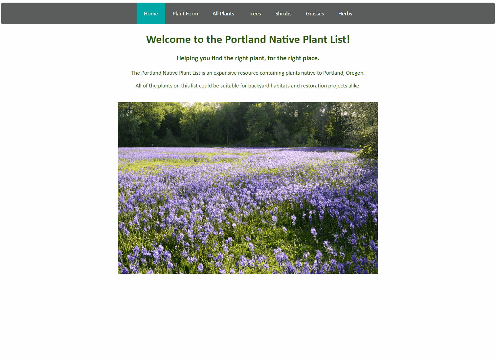

# Portland Native Plant List
## Flatiron School Phase 2 Project

This project was bootstrapped with [Create React App](https://github.com/facebook/create-react-app).

## Features

The Portland Native Plant List is an expansive resource containing plants native to Portland, Oregon.\
All of the plants on this list could be suitable for backyard habitats and restoration projects alike.\
The site allows you to add plants to the database and view them by type.

## Available Scripts

If you'd like to contribute to the database, you may fork this repo and submit your changes for approval to codybarker.or@gmail.com

In the project directory, you can run:

### `npm start`

Runs the app in the development mode.\
Open [http://localhost:3000](http://localhost:3000) to view it in your browser.

The page will reload when you make changes.\
You may also see any lint errors in the console.

### `json-server --watch db.json --port 3001`

Runs a local json server to host the plant list data.\
Open [http://localhost:3001/plantlist](http://localhost:3001/plantlist) to view it in your browser.

## Support
e: codybarker.or@gmail.com

## Project Status
In development and unlicensed

## Author
Cody Barker

